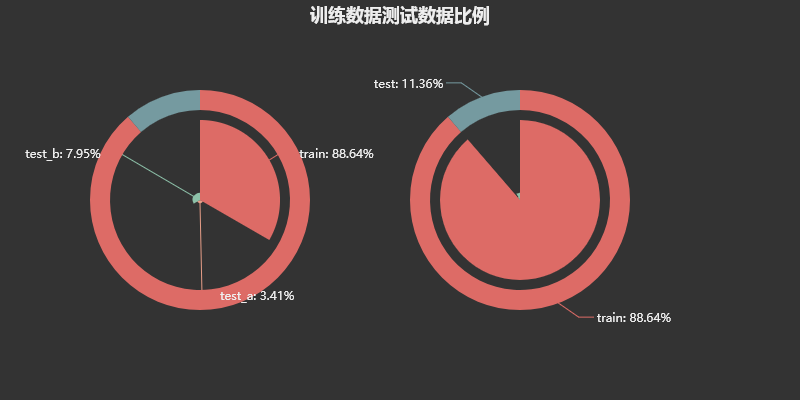
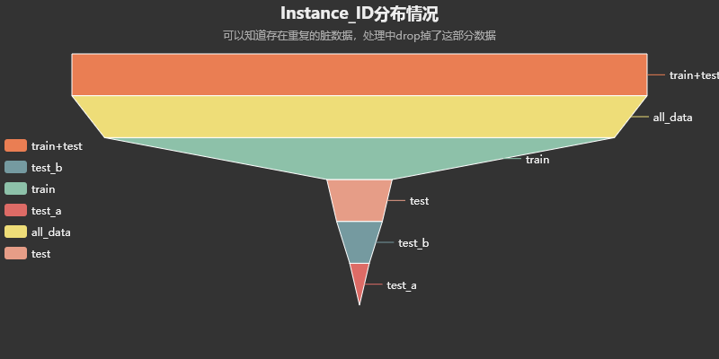
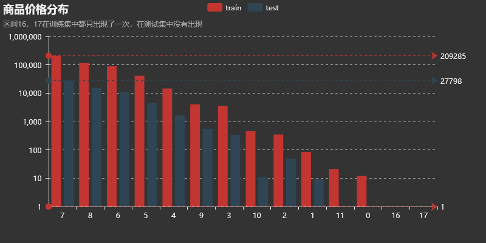
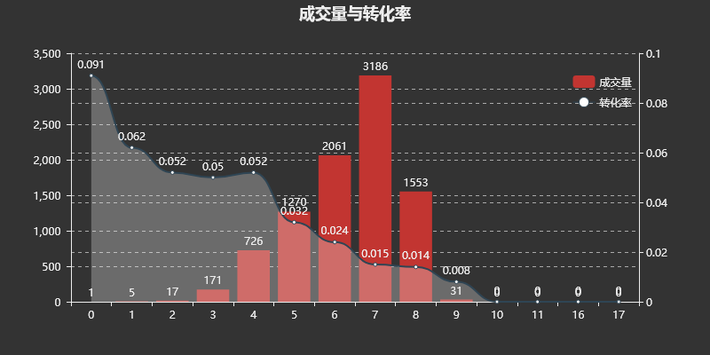
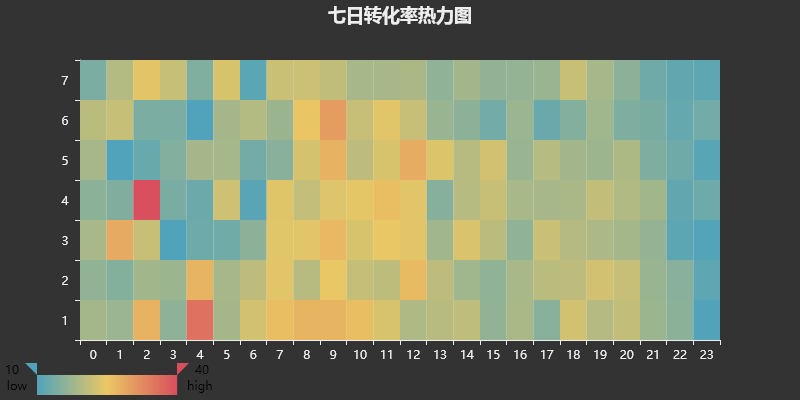
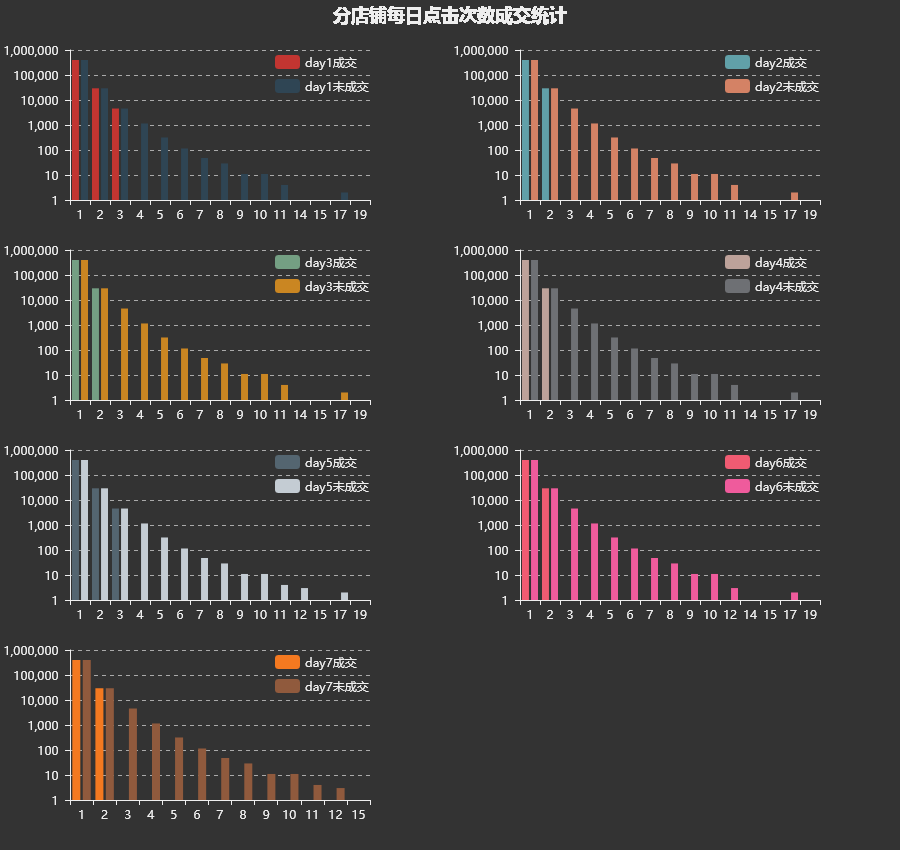

### 1. 数据来源

阿里电商广告为研究对象，提供了淘宝平台的海量真实交易数据，参赛选手通过人工智能技术构建预测模型预估用户的购买意向，即给定广告点击相关的用户（user）、广告商品（ad）、检索词（query）、上下文内容（context）、商店（shop）等信息的条件下预测广告产生购买行为的概率（pCVR）

pCVR=P(conversion=1 | query, user, ad, context, shop)。 

了解数据

1. 提供了user，item，context，shop相关的数据
1. instance_id不作为特征，但是能看出来，实际上有重复instance_id的数据
1. item_id 全数据要比train多，说明有新品，这些新品的点击率要靠其他商品信息做参考
1. item_property_list 要分解之后，总共就三段应该不用分解了。
1. item_brand_id全数据依然多
1. item_city_id测试数据集中多两个
1. [查]item_price_level 测试集要比训练集要少，多的这部分可能是没用的。要不要看看有没有成交记录？这个不一定要删除，如果分桶的话，就无所谓了。
1. shop_id，全数据比训练数据高，说明有122家新店。
1. [查]shop_review_num_level 评价数量等级，这个也没有。
1. 不同性别的成交率，男的成交率要高

比赛提供了七天数据，预测后一天的数据。

看一下，数据分布的情况，其中instance_id按照定义是不应该有重复的情况的，从数据看来提供的样本中有instance_id重复的数据。下表观察其他特征，可以看出有部分特征的值数据在训练集中包含，但是在测试集中并没有对应的项目，考虑这部分数据处理掉。

|fea|all_data|train+test|train|test|test_a|test_b|
|-|-|-|-|-|-|-|
|instance_id|539337|539346|478087|61259|18371|42888|
|item_id|10527|15726|10075|5651|3695|5051|
|item_property_list|11530|16551|10908|5643|3690|5044|
|item_brand_id|2104|3469|2055|1414|1101|1316|
|item_city_id|130|243|128|115|99|112|
|item_price_level|14|26|14|12|10|12|
|item_pv_level|22|44|22|22|21|21|
|user_id|219774|227090|197694|29396|13573|24070|
|context_id|539370|539370|478111|61259|18371|42888|
|context_timestamp|319327|319327|281824|37503|15592|30004|
|predict_category_property|87135|92787|78796|13991|6964|11680|
|shop_id|4081|6657|3959|2698|2015|2488|
|shop_review_num_level|25|49|25|24|21|24|
|shop_review_positive_rate|13485|13654|11825|1829|1302|1657|
|shop_score_service|18572|18923|16361|2562|1963|2378|
|shop_score_delivery|18620|18972|16423|2549|1961|2368|
|shop_score_description|18692|19023|16463|2560|1959|2377|

### 

价格区间在16，17的样本，只在训练集中出现，测试机没有出现，而且，量不大，考虑删掉。

可以看出：

- 成交量比较少的转化率会显得稍高，成交量比较高商品集中在6-8价格区间，转化率在1.5%左右。
- 价格区间在10以上的，没有成交记录。

点击次数和成交的关系，日期的分布，得到日期的分组，初赛是平日转化率预估，复赛是特殊日期的转化率预估。

1. 根据上面这个结果看的话，训练数据应该选[2，3，4，6，7]
1. 假设，1是周一，2是周2，3是周3，周一，和周五有相对较多的点击次数，这样应该是。需要预测的那一天应该是周一，会是图1的趋势。
1. 这个数据说明，点击率超过3次，基本不会买，正常会买的点击次数在三次以内。

### 2. 数据预处理

1. 去除重复值，点击记录的重复值
1. 数据拼接，训练和测试数据整合在一起，一起做特征。
1. 连续值类型，标准化
1. price_level在测试集中出现了两个比较大的数据，16，17，删掉
1. price_level在10以上的没有成交数据

### 3. 特征工程

1. [天]同一个用户点击的数量
1. [天]同一个商品被点击的数量
1. [天，小时]历史转化率
1. [全] 性别的处理，按照成交比例添加在数据中
1. [天] collected level的成交率，按照每天的统计。这个参数应该和day没有关系，短时间内的平均水平决定了这个参数。
1. 价格-成交率统计特征
1. 时间特征，每个小时的成交率
1. 相关系数，collected_level和sales_level两个特征差不多，age。star,occupation可以推出gender
1. 缺失值分析: 
   1. tem_city_id, shop_review_positive_rate，如果存在缺失，没有成交记录
   1. item_sales_level如果有缺失，成交几率很低
1. Item_id，shop_id前者包含了后者信息
1. 一天内同一个user在一个店铺点击不会超过3次，超过3次不会购买。
1. 做了数据星期假设，总共给了一周的数据，而这些数据应该是和星期有关系的。确定需要预测的趋势是周一。
